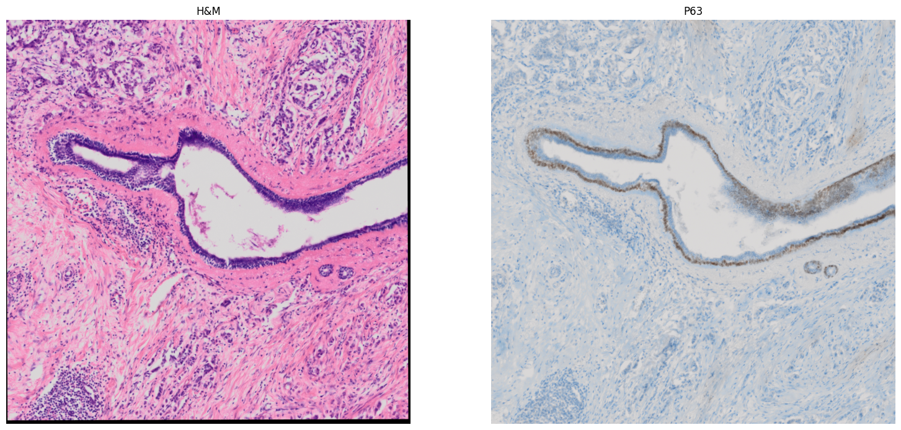

# Histology image correction / enhancement
Name: Erik Matovič  
Methods used: Color segmentation, image correction, image enhancement

## Assignment
### Dataset  
Dataset link: [link](https://drive.google.com/file/d/11_y1TZOKQb7xl4esCCjYcM9o4uv7w5pC/view) (Histology nuclei)  

[H&M](https://drive.google.com/file/d/1o7PdpZfsnh7O4xbbwNt3Y7zyPhsZWW3J/view) and [P63](https://drive.google.com/file/d/1a70V9PDNdzAV4FDyEVaqV6ZbUfFflzA6/view) registered images.  

The stained colors of the tissue components are popularly used as features for image analysis. Dataset contain stained histology images. Variations in the staining condition of the histology slides could however negatively impact the accuracy of the analysis.   

The assignment goal is to experiment with the histology images and try to correct the color distribution of the provided dataset.  

### Experiment with the following tasks for image correction
 - Histogram computation (visualize histogram for each color model used)
 - Histogram equalization - for multiple color models (Grayscale, RGB, YCbCr, HSV, XYZ, Lab). Make assumption how to properly correct the image using following color models and document the steps with your reasoning.
 - Gamma correction (hint: pow)
 - **Optional:** Source -> Target color correction using eCDF (effective Cummulative Distribution Function) and linear interpolation
   - Target is an image you selected from the dataset. We want to change the color distribution of other (sources) images to the target one
   - for RGB and YCbCr only

### Experiment with the following tasks for image enhancement
 - Segmentation utilizing the color information (Lab color model)
   - Make sure your Lab conversion is in correct data range 
   - Select the small part of the image containing only nuclei and compute its Lab color model (target) - average L / a / b values
   - Compute delta Lab - difference image between the input and the target
     - Hint how to compute difference in the slides from lecture
     - Visualize
   - Use the obtained difference image and try to segment nuclei by thresholding
 - Use your knowledge of local descriptors to detect and localize image patch within the larger image from following data - [link](https://drive.google.com/file/d/10oNHED7BGrcYomKd3Cn5J1ZKQuQ9TR5d/view)
   - Experiment with feature detectors: SIFT, FAST, Harris
   - Experiment with feature descriptors: SIFT, SURF, ORB
   - Compute homography matrix and localize your image patch
     - Find the best combination of detection & description for your task


## Usage
To run Jupyter Notebook, you need OpenCV and matplotlib. You can install them using pip:  
```bash
pip install opencv-python matplotlib
```

[OpenCV documentation](https://docs.opencv.org/4.7.0/)

## Solution
### 1. Load images and convert to float32
After loading images, we converted them from uint8 to float32 in range 0-1.

```python3
img_f32 = img.astype(np.float32)
img_f32 /= 255.0
```

Images:  
<p align="center">
	
</p>


### 2. Image correction
Histogram computation (visualize histogram) using calcHist():

```python3
bgr_model = ('b', 'g', 'r')

# iterate through the list of images
for img in images:
    # iterate through the colors of the BGR model
    for i, col in enumerate(bgr_model):
        # calculate a histogram of each color model for each image
        histr = cv2.calcHist(images=[img], channels=[i], mask=None, histSize=[256], ranges=[0,256], accumulate=False)
        # add to the subplot
        axarr[plt_index].plot(histr, color=col)
    # row iterate
    plt_index += 1
    # if its out of bound move a row
    if plt_index > 1:
        plt_index = 0
```

<p align="center">
	
</p>

Comparing histograms:  
"For the Correlation and Intersection methods, the higher the metric, the more accurate the match. For the other two metrics, the less the result, the better the match."[[1]](https://docs.opencv.org/3.4/d8/dc8/tutorial_histogram_comparison.html)

```python3
for compare_method in range(4):
    histr_histr = cv2.compareHist(histr, histr, compare_method)
    histr_histr_RGB = cv2.compareHist(histr, histr_RGB, compare_method)
    histr_histr_YCBCR = cv2.compareHist(histr, histr_YCBCR, compare_method)
    histr_histr_XYZ = cv2.compareHist(histr, histr_XYZ, compare_method)
```

| Method        | BGR-BGR  | BGR-RGB  | BGR-YCbCr  | BGR-XYZ  |
| ------------- | -------- | -------- | ---------- | -------- |
| Correlation   |   1.0    |   0.1    |    0.8     |   0.1    |
| Chi-square    |   0.0    | 35327794 | 5442664119 | 35327794 |
| Intersection  | 36000000 | 672206   |   26071505 |   672206 |
| Bhattacharyya |   0.0    |   0.9    |    0.2     |   0.9    |

Histogram equalization:  
```python3
img_hm_rgb = cv2.cvtColor(img_hm, cv2.COLOR_BGR2RGB)

(hm_r, hm_g, hm_b) = cv2.split(img_hm_rgb)

output1_R = cv2.equalizeHist(hm_r)
output1_G = cv2.equalizeHist(hm_g)
output1_B = cv2.equalizeHist(hm_b)

equ_h = cv2.merge((output1_R, output1_G, output1_B))

plt_img(img_hm_rgb, equ_h, title2='equalizeHist')
```
<p align="center">
	
</p>

Gamma correction:  
```python3
def gamma_coorection(img: cv2.Mat, gamma:float) -> cv2.Mat:
    """
    Gamma correction
    """
    lookUpTable = np.empty((1,256), np.uint8)
    for i in range(256):
        lookUpTable[0, i] = np.clip(pow(i / 255.0, gamma) * 255.0, 0, 255)
    return cv2.LUT(img, lookUpTable)
```
<p align="center">
	
</p>

### 3. Image enhancement
Segmentation utilizing the color information (Lab color model)
   - Lab conversion 
   - Select the small part of the image containing only nuclei and compute its Lab color model (target) - average L / a / b values
   - Compute delta Lab - difference image between the input and the target

```python3
mean_lab_ = np.mean(img_hm_lab[y_[0]:y_[1],x_[0]:x_[1],:], axis=(0,1))
deltaLab_ = img_p63_lab - mean_lab_
low = np.array([0, 0, 0])
high = np.array([0, 0, 255])
mask = cv2.inRange(deltaLab_rgb_, low, high)
result = cv2.bitwise_and(img_p63_lab, img_p63_lab, mask=mask)
```  

Vizualize delta Lab:
<p align="center">
	
</p>

Color segmentation with its mask:
<p align="center">
	
</p>

Local descriptors to detect and localize image patch within the larger image from the following datataset:
<p align="center">
	
</p>

Keypoints:
<p align="center">
	
</p>

```python3
sift = cv2.SIFT_create()
img_original_keypoints = sift.detect(img_original_gray, None)
img_sift_keypoints = img_original.copy()
img_sift_keypoints = cv2.drawKeypoints(img_original_gray, img_original_keypoints, img_sift_keypoints, flags=cv2.DRAW_MATCHES_FLAGS_DRAW_RICH_KEYPOINTS)

orb = cv2.ORB_create()
# find the keypoints with ORB
kp = orb.detect(img_original_gray, None)
# compute the descriptors with ORB
kp, des = orb.compute(img_original_gray, kp)
# draw only keypoints location
img_original_orb = cv2.drawKeypoints(img_original_gray, kp, None, color=(0,255,0), flags=0)
```  

Compute homography matrix and localize your image patch using ORB. We can see that matching is all over the place. The green part of the image is roughly location of the patch.

<p align="center">
	
</p>

```python3
# Find the keypoints and descriptors with ORB
kpts1, descs1 = orb.detectAndCompute(img_original_gray,None)
kpts2, descs2 = orb.detectAndCompute(patch3_gray,None)

# match descriptors and sort them in the order of their distance
bf = cv2.BFMatcher(cv2.NORM_HAMMING, crossCheck=True)
matches = bf.match(descs1, descs2)
dmatches = sorted(matches, key = lambda x:x.distance)

# extract the matched keypoints
src_pts  = np.float32([kpts1[m.queryIdx].pt for m in dmatches]).reshape(-1,1,2)
dst_pts  = np.float32([kpts2[m.trainIdx].pt for m in dmatches]).reshape(-1,1,2)

# find homography matrix and do perspective transform
M, mask = cv2.findHomography(src_pts, dst_pts, cv2.RANSAC, 5.0)
h,w = img_original_gray.shape[:2]
pts = np.float32([[0,0],[0,h-1],[w-1,h-1],[w-1,0]]).reshape(-1,1,2)
dst = cv2.perspectiveTransform(pts,M)

# draw found regions
img2 = cv2.polylines(patch3_gray, [np.int32(dst)], True, (0,0,255), 1, cv2.LINE_AA)

# draw match lines
res = cv2.drawMatches(
  img1=img_original_gray, keypoints1=kpts1, img2=img2, keypoints2=kpts2, 
  matches1to2=dmatches[:20],outImg=None, matchColor=(0,255,0), flags=cv2.DrawMatchesFlags_NOT_DRAW_SINGLE_POINTS
)
``` 

Compute homography matrix and localize your image patch using SIFT. We can see that matching is much better. The green part of the image is roughly location of the patch.

<p align="center">
	
</p>

```python3
MIN_MATCH_COUNT = 10
# find the keypoints and descriptors with SIFT
kp1, des1 = sift.detectAndCompute(img_original_gray, None)
kp2, des2 = sift.detectAndCompute(patch3, None)

FLANN_INDEX_KDTREE = 1
index_params = dict(algorithm = FLANN_INDEX_KDTREE, trees = 5)
search_params = dict(checks = 50)
flann = cv2.FlannBasedMatcher(index_params, search_params)
matches = flann.knnMatch(des1,des2,k=2)
# store all the good matches as per Lowe's ratio test.
good = []
for m,n in matches:
    if m.distance < 0.1 * n.distance:
        good.append(m)

if len(good)>MIN_MATCH_COUNT:
    src_pts = np.float32([ kp1[m.queryIdx].pt for m in good ]).reshape(-1,1,2)
    dst_pts = np.float32([ kp2[m.trainIdx].pt for m in good ]).reshape(-1,1,2)
    M, mask = cv2.findHomography(src_pts, dst_pts, cv2.RANSAC,5.0)
    matchesMask = mask.ravel().tolist()
    h,w = img_original_gray.shape
    pts = np.float32([ [0,0],[0,h-1],[w-1,h-1],[w-1,0] ]).reshape(-1,1,2)
    dst = cv2.perspectiveTransform(pts,M)
    img2 = cv2.polylines(patch3_gray,[np.int32(dst)],True,255,3, cv2.LINE_AA)
else:
    matchesMask = None

img3_ = cv2.drawMatches(
  img_original_gray, kp1, img2, kp2, good, None, 
  matchColor = (0,255,0),      # draw matches in green color
  singlePointColor = None,
  matchesMask = matchesMask,    # draw only inliers
  flags = 2
)
``` 